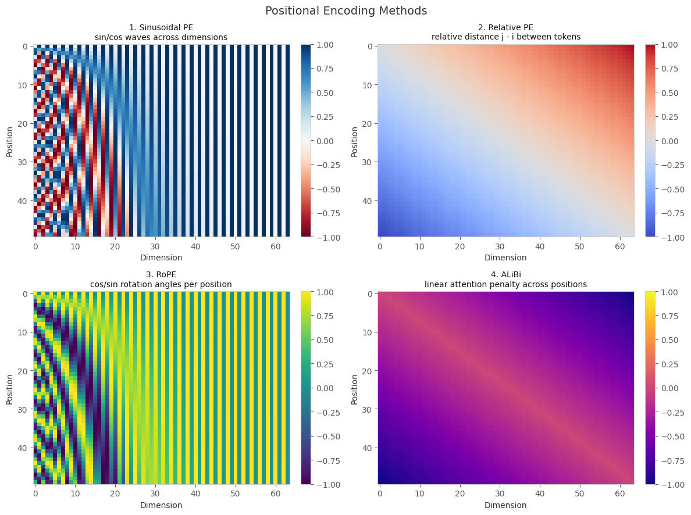
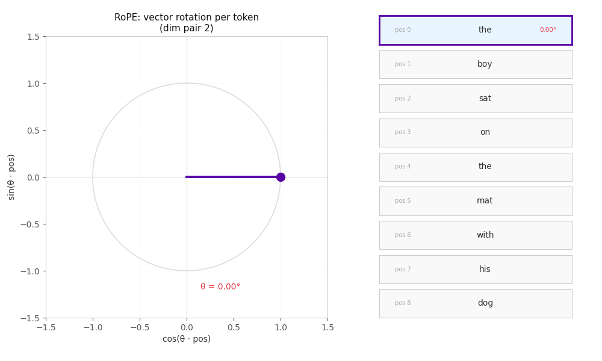

# Positional Encoding in Transformers

This repo walks through four of the most important positional encoding methods used in transformer models: Sinusoidal, Relative, RoPE, and ALiBi. The goal is to build genuine intuition for why each one exists, what problem it was solving, and how the field moved from one to the next.

## Why does positional encoding exist?

A transformer processes all tokens at the same time in parallel. Unlike an RNN that reads left to right and naturally knows which word came first, a transformer sees every token at once and has no built-in sense of order.

Without positional encoding, these two sentences would produce identical token embeddings:

```
"the dog bit the man"
"the man bit the dog"
```

Same words, same vectors, no way to tell them apart. Positional encoding is how we inject order into that otherwise position-blind attention mechanism.

## The four methods



### 1. Sinusoidal PE

The original method from the infamous (lol 🙂) *Attention Is All You Need* (2017). Each position gets a unique pattern of sine and cosine values across the embedding dimensions, using different frequencies per dimension. Low dimensions oscillate fast, high dimensions oscillate slowly. Together they create a fingerprint that is unique to every position.

```
PE(pos, 2i)   = sin(pos / 10000^(2i/d))
PE(pos, 2i+1) = cos(pos / 10000^(2i/d))
```

It requires no training and can generate encodings for sequences longer than anything seen during training.

**Problems it left unsolved**

The model learns "this word is at position 20" but what language actually cares about is "this word is 2 steps away from that one." Relative distance matters more than absolute index. It also struggles as sequences get longer, attention patterns become harder to interpret and quality drops.

### 2. Relative PE

Instead of telling the model where each token is, relative PE tells it how far apart any two tokens are. The attention mechanism gets modified to include a learned embedding for the distance between each query and key pair.

So rather than:
```
"sat" is at position 3
```
the model learns:
```
"sat" is 1 step after "boy", 2 steps before "on"
```

This aligned much better with how language actually works. The downside was cost. Storing and computing all those pairwise distances gets expensive fast, especially for long sequences.

### 3. RoPE (Rotary Positional Encoding)

RoPE is the method used in LLaMA, Mistral, and most modern open source LLMs. Instead of adding a position vector to the token embedding, it rotates the query and key vectors in 2D planes before the dot product is computed. Each token position corresponds to a specific rotation angle, and the dot product between two rotated vectors naturally encodes their relative distance without any explicit distance table.

The animation below shows this directly. Each token gets its embedding vector rotated by a progressively larger angle. The further apart two tokens are, the more their vectors have rotated relative to each other.



RoPE gave transformers relative position awareness without the memory cost of explicit pairwise matrices, and it generalised to longer sequences much better than anything before it. The main weakness is that at very long contexts the rotations can become unstable and attention quality starts to degrade.

### 4. ALiBi

ALiBi takes a completely different approach. Rather than changing the embeddings at all, it adds a fixed linear penalty directly to the attention scores. Tokens that are further apart get a larger negative bias, so attention naturally decays with distance.

```
attention score = QKᵀ  (m × distance)
```

Think of it like hearing people in a room. Someone close is easy to hear. Someone far away gets naturally filtered out. Each attention head gets a different slope m, giving the model multiple views of how quickly to discount distant context.

It is simpler than RoPE, trains faster, and its biggest strength is length extrapolation: a model trained on 2048 tokens can often generalise to 8000 or more at inference time. The tradeoff is expressiveness. Not all language relationships are linearly distance-based, so it can miss finer positional structure that RoPE captures.

## How they evolved

Each method was a direct response to the limitation of the one before it.

Sinusoidal worked but only captured absolute position. Relative PE fixed that but was too expensive. RoPE kept the relative awareness while being efficient and geometrically elegant. ALiBi asked whether you even needed to touch the embeddings at all, and the answer turned out to be no.

## What modern LLMs actually use

Most frontier models today use RoPE or a variant of it with dynamic scaling to handle very long contexts. ALiBi is used in some smaller efficiency-focused models. Pure sinusoidal PE has mostly been retired.
